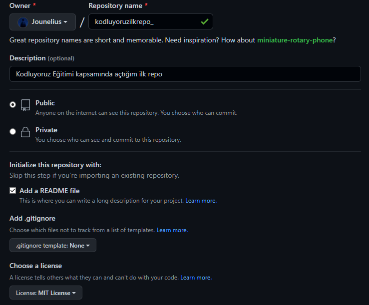

# Kodluyoruz Ilk Repo
Bu repo Kodluyoruz Front-End Eğitiminde Oluşturduğumuz İlk Repo. İçerisinde bir adet README dosyası, bir adet de index.html barındırıyor.



## Installation
Öncelikle projeyi clonelayın. (Buraya sizin reponuzdan aldığınız link gelecek)

```
git clone https://github.com/Jounelius/kodluyoruzilkrepo.git
```

## USAGE
Projeyi cloneladıktan sonra Visual Studio Code programında açınız.

Linux için:
```
cd kodluyoruzilkrepo
code .
```
## Contributing
Pull request kabul edilir. Büyük değişiklikler için, lütfen önce neyi değiştirmek istediğinizi tartışmak için bir konu açınız.
## License
[MIT](LICENSE)

https://app.patika.dev/jounne
